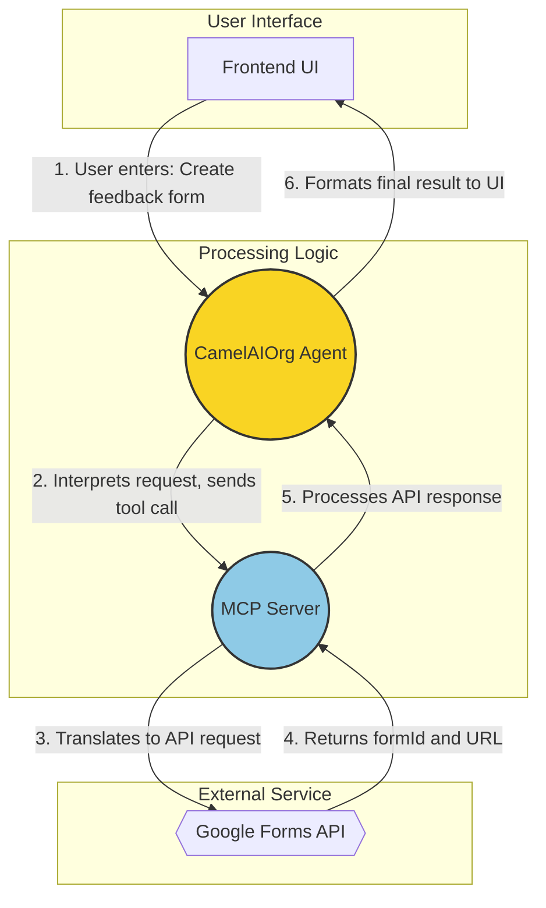

# Google Forms MCP Server with CamelAIOrg Agents Integration

A Model Context Protocol (MCP) server that integrates with Google Forms API and CamelAIOrg Agents to create, modify, and retrieve forms using natural language instructions.

## Overview

This project enables the creation and management of Google Forms through natural language requests. It consists of two main components:

1. **MCP Server**: A Flask-based server that implements the Model Context Protocol (MCP) to expose Google Forms operations as tools.
2. **CamelAIOrg Agents**: An AI agent framework that processes natural language requests and translates them into MCP tool calls.

The system features a dark-themed UI with an animated visualization of the request flow between frontend, agents, MCP server, and Google APIs.

## Features

- Create Google Forms from natural language requests
- Add different types of questions (text, paragraph, multiple-choice, checkbox)
- Retrieve form responses
- Visualize the flow of requests and responses
- Dark-themed UI with animations
- Full MCP (Model Context Protocol) compliance
- Containerized with Docker for easy deployment

## Architecture

```
┌─────────────┐    ┌─────────────┐    ┌────────────┐    ┌────────────┐
│             │    │             │    │            │    │            │
│   Frontend  │◄──►│ CamelAIOrg  │◄──►│ MCP Server │◄──►│  Google    │
│    (UI)     │    │   Agents    │    │            │    │ Forms API  │
│             │    │             │    │            │    │            │
└─────────────┘    └─────────────┘    └────────────┘    └────────────┘
```

### Process Flowchart

This diagram illustrates how a user request flows through the system:



### Role of Components

*   **Frontend UI:** Provides the user interface for inputting natural language requests and visualizing the process and results.
*   **CamelAIOrg Agent (Highlighted Yellow):**
    *   **Responsibility:** Interpretation and Planning.
    *   Receives the raw natural language request.
    *   Parses the request to understand the user's intent and extract key details (form title, questions, types, etc.).
    *   Determines the sequence of actions (MCP tool calls) needed to fulfill the request.
    *   Communicates with the MCP Server using the defined tool schema.
*   **MCP Server (Highlighted Blue):**
    *   **Responsibility:** Execution and Abstraction.
    *   Receives structured tool calls from the Agent.
    *   Acts as a dedicated interface to the Google Forms API.
    *   Translates the abstract tool calls (e.g., `create_form`) into concrete Google Forms API requests.
    *   Handles authentication, communication, and error handling with the Google Forms API.
    *   Returns the results from the Google Forms API back to the Agent in a standardized MCP format.

### Why is the MCP Server Needed?

The Model Context Protocol (MCP) server acts as a crucial intermediary layer for several reasons:

1.  **Abstraction:** It hides the complexities of the underlying Google Forms API from the CamelAI Agent. The Agent doesn't need to know the specific endpoints, authentication methods, or request/response formats of the Google API. It only needs to know the simplified MCP tool schema (e.g., `create_form`, `add_question`).
2.  **Modularity & Reusability:** The Agent can be designed to interact with any service that exposes an MCP interface. If you wanted to add support for another form service (e.g., Typeform), you could create a separate MCP server for it, and the Agent could potentially use it with minimal changes, just by learning the new MCP tool schema.
3.  **Standardization:** MCP provides a standard way for AI models/agents to interact with external tools and APIs. This promotes interoperability.
4.  **Security & Control:** The MCP server can enforce policies, manage API keys securely, handle rate limiting, and provide a controlled gateway to the external API, rather than embedding sensitive credentials or complex logic directly within the agent.
5.  **Maintainability:** Separating the API interaction logic (MCP Server) from the natural language understanding and planning logic (Agent) makes the system easier to maintain and update. Changes to the Google Forms API only require updates to the MCP server, not the Agent itself.

## Prerequisites

- Docker and Docker Compose
- Google Cloud Platform account
- Google Forms API enabled
- OAuth2 credentials from Google Cloud Console

## Setup Instructions

### 1. Clone the Repository

```bash
git clone https://github.com/yourusername/google-form-mcp-server.git
cd google-form-mcp-server
```

### 2. Set Up Google Forms API

1. Go to the [Google Cloud Console](https://console.cloud.google.com/)
2. Create a new project
3. Enable the Google Forms API and Google Drive API
4. Create OAuth2 credentials
   - Web application type
   - Add authorized redirect URI: `http://localhost:5000/oauth2callback`
5. Download the credentials JSON file

### 3. Configure Environment Variables

Create a `.env` file in the root directory:

```
# Google API Credentials
GOOGLE_CLIENT_ID=your_client_id_here
GOOGLE_CLIENT_SECRET=your_client_secret_here
GOOGLE_REFRESH_TOKEN=your_refresh_token_here

# Server Configuration
FLASK_ENV=development
PORT=5000
DEBUG=True

# CamelAIOrg Agents Configuration
AGENT_ENDPOINT=http://agents:5001/process
AGENT_API_KEY=your_agent_api_key_here
```

To obtain a refresh token:

1. Use the OAuth 2.0 Playground: https://developers.google.com/oauthplayground/
2. Set up with your credentials
3. Select the required scopes:
   - https://www.googleapis.com/auth/forms
   - https://www.googleapis.com/auth/drive
   - https://www.googleapis.com/auth/drive.file
4. Exchange authorization code for tokens
5. Copy the refresh token to your `.env` file

### 4. Build and Run with Docker Compose

```bash
docker-compose up --build
```

This will start both the MCP Server (on port 5000) and the CamelAIOrg Agents service (on port 5001).

## Usage

### Web Interface

Access the web interface at `http://localhost:5000`

The interface allows you to:
1. Enter natural language requests (e.g., "Create a feedback form with 3 questions")
2. View the request flow between components
3. See the generated form details and links
4. View the MCP packets being exchanged

### API Endpoints

#### MCP Server Endpoints (Port 5000)

- `GET /api/health` - Health check
- `GET /api/schema` - Get MCP tools schema
- `POST /api/process` - Process MCP requests

#### CamelAIOrg Agent Endpoints (Port 5001)

- `GET /health` - Health check
- `GET /schema` - Get agent capabilities
- `POST /process` - Process natural language requests

## Example Requests

Here are some example natural language requests you can try:

1. "Create a customer feedback form with a rating question from 1-5 and a text question for additional comments"
2. "Create a survey about remote work preferences with 3 multiple choice questions"
3. "Create an event RSVP form with name, email and attendance options"

## MCP Protocol Format

The MCP Server accepts requests in the following format:

```json
{
  "transaction_id": "unique_transaction_id",
  "tool_name": "create_form",
  "parameters": {
    "title": "Form Title",
    "description": "Form Description"
  }
}
```

And responds with:

```json
{
  "transaction_id": "unique_transaction_id",
  "status": "success",
  "result": {
    "form_id": "form_id",
    "response_url": "https://docs.google.com/forms/d/form_id/viewform",
    "edit_url": "https://docs.google.com/forms/d/form_id/edit",
    "title": "Form Title"
  }
}
```

## Development

### Project Structure

```
google-form-mcp-server/
├── server/                 # MCP Server
│   ├── app.py              # Main Flask application
│   ├── config.py           # Configuration
│   ├── forms_api.py        # Google Forms API integration
│   ├── mcp_handler.py      # MCP protocol handler
│   ├── requirements.txt    # Python dependencies
│   ├── static/             # Static assets
│   ├── templates/          # HTML templates
│   └── utils/              # Utility functions
├── agents/                 # CamelAIOrg Agents
│   ├── agent_integration.py # Agent implementation
│   ├── agent_server.py     # Agent API server
│   └── requirements.txt    # Python dependencies
├── Dockerfile              # MCP Server Dockerfile
├── docker-compose.yml      # Docker Compose configuration
├── .env.example            # Example environment variables
└── README.md               # Project documentation
```

### Running Without Docker

To run the MCP Server without Docker:

```bash
cd server
pip install -r requirements.txt
python app.py
```

To run the Agents service without Docker:

```bash
cd agents
pip install -r requirements.txt
python agent_server.py
```

## License

MIT

## Acknowledgements

- Google Forms API
- CamelAIOrg for their agent framework
- Model Context Protocol (MCP) specification
